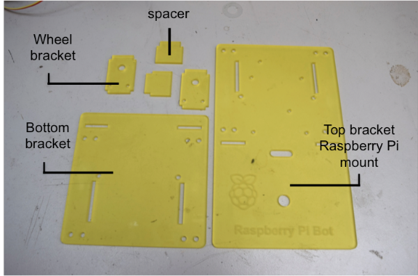

# Build your First Robot

Want to get started with robotics but not sure how? Start here with our guide to building a very simple Raspberry Pi bot!

## Create your Robot Chassis
Any roaming robot device needs a chassis to hold the motors and wheels in place and in this case to mount your Raspberry Pi onto. If you already have a chassis then you can skip this step and go onto the next one. 

You may have access to a make space that has a laser cutter, or maybe your school has one which you can ask to adult to help you cut the chassis that we have used in this tutorial. 

- Print this file to make a paper template
- Use this file with a laser cutter

## Build our Robot Chassis
Unless you have used our Robot chassis, build your chassis by following the manufacturers instructions and move onto Step 3.

1. Lay out all the parts of your robot chassis. 

	
	
1. Connect the wheels to their motor and gears by pushing the white rod into the centre of the wheel.
1. Take two male to male jumper wires, and cut off the connectors at one end.
1. Ask an adult to strip and solder the exposed wires to the metal connectors underneath the motor, one on each side. 
1. Repeat the above steps on the second wheel and motor.

	

1. Attach the wheel brackets to the wheel motors with some M3 screws so that your wheels look like the above image.
1. Using some M2.5 screws attach your Raspberry Pi with it's micro SD or SD card already inserted to the mount board. 
1. Sandwich the two wheels between the top bracket that your Raspberry Pi sits on, with the smaller bottom bracket. Using cable ties on each of the four corners to hold them together.
1. Add a castor to the front of the Raspberry Pi mount board with some screws.
1. Plug your Pibrella into the first 26 pins of your Raspberry Pi that has already been mounted on the chassis. 
1. Finally connect the jumper cables soldered to the wheel motors to the Pibrella board. With the bot facing you, take the jumper wires from the left hand wheel motor and plug one into input **E** on the pibrella and the other next to it in the ground input. Repeat with the right hand wheel motor jumper wires, plugging one into input **F** and the other into the adjacent input on the ground bank. 

	

## Connect to your Raspberry Pi
Now that you have built your Raspberry Pi Robot, you will need to start up your Raspberry Pi in order to test that it works, and to write programs to make it move how you want it to.

1. Connect your Raspberry Pi to a monitor, keyboard and mouse before turning it on. Log in and then load the graphical user interface by typing `startx`.
1. Open a `Terminal` window by clicking on **Main Menu**, **Accessories** followed by **Terminal**.
1. Type `sudo idle3 &` to load the Python IDLE programming environment. 
1. Once it has loaded open a new text editor file by clciking on **File** and **New Window**.
1. Finally click on **File** and **Save As**, then name your python file **first-robot.py**.

## Make your robot move

Now you are setup, you can write the code to make your bot move! 

1. Begin by importing the Pibrella library by typing `import pibrella` on the first line. 
1. On the next line type `import time`, you will need this library to add pauses in the program.
1. Next type:

	```python
	pibrella.output.e.on()
    pibrella.output.f.on()
    time.sleep(2)
    pibrella.output.e.off()
    pibrella.output.f.off()
 	```
    	
1. Click on **File** and **Save** to save your code or press `Ctrl + S` on the keyboard.
1. Now it is time to test that it works. 

	*Ensure that your robot is turned upside down on a table so that when you run your program you will see the wheels moving but it will not run off the table. Remember it is connected by cables right now that might cause a problem!*
	
	Click on **Run** and **Run Module** or press `F5` on your keyboard to run your program. You should see the wheels on our robot turn on for 2 seconds and then turn off.
	
## Make your robot turn

To make the wheels turn and move the robot forward you only need a simple program that turns on both motors for a period of time. But what if you want to turn right? 

The simplest way to turn, is to make one motor on the left hand side turn on and keep the right motor switched off. This will turn the robot right.

1. Add the following code to your python file at the bottom:

	```python
    pibrella.output.f.on()
    sleep(5)
    pibrella.output.f.off()
    ```
1. Save the file and run your code to see if it works.	

## Using the big red button to start the program

Let's program the robot to turn in a square formation. You might need to get the robot into position before running the program. It makes sense to use the red button on the Pibrella board to start the movement. First put the directions into functions.

1. Open your program and above the first sequence you wrote to move forward type:

	```python
	def forward(seconds):
	```
1. Then indent the sequence to move foward underneath like this:
	
	```python
	def forward(seconds):
		pibrella.output.e.on()
		pibrella.output.f.on()
		time.sleep(seconds)
		pibrella.output.e.off()
		pibrella.output.f.off()
    ```

	*Indentation in important in Python. The indented code here tells us that it belongs inside the function defined as `forward`. Use four spaces to indent in Python*

1. Navigate to the next section of code to turn right and type:

	```python
	def right(seconds):
	```
1. Like before, add the sequence of code to turn right into the function you have just defined so that it is indented by four spaces like this:	

	```python
	def right(seconds):
		pibrella.output.f.on()
    		sleep(seconds)
    		pibrella.output.f.off()
	```

1. Now add a function to call the foward and right functions four times in a loop when the button is pressed like this:
	
	```python
	def button_pressed():

		for i in range(0,4):
			forward(0.5)
			right(0.9)
	```
	
	*To make a square, you would need to move forward and turn right four times. Think about how you might do this in turtle to help visualise what is happening. See [Drawing snowflakes with Turtle](http://www.raspberrypi.org/learning/turtle-snowflakes/) Resource for more info*
	
1. Now, a loop is needed to check that the button has been pressed or not. To do this you can use a forever loop in Python called `while True:`. At the bottom of your program type:

	```python
	while True:
		if pibrella.button.read():
			button_pressed()
	```

1. Save your file and run your code. Disconnext the HDMI cable, keyboard and mouse from the Raspberry Pi but not the power cable! Then find a place for your robot on the floor or table.

1. Press the red button! Your robot should draw a square. 
